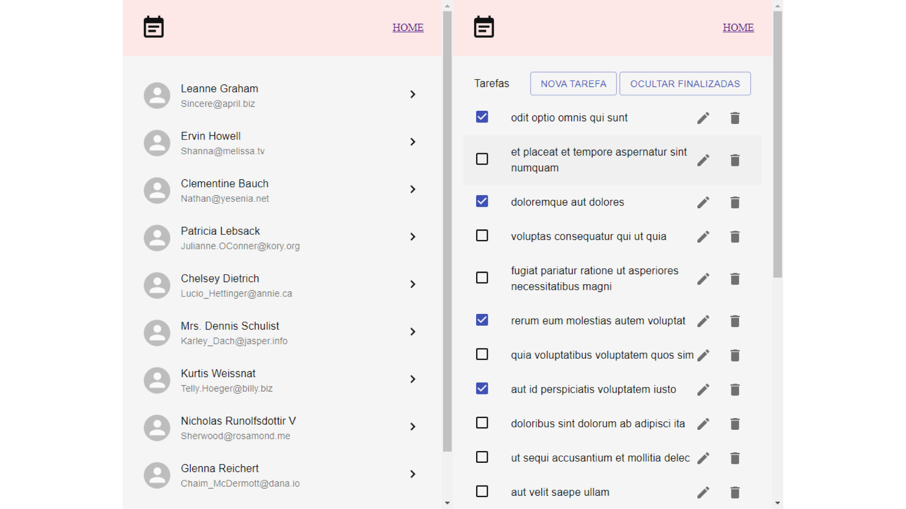
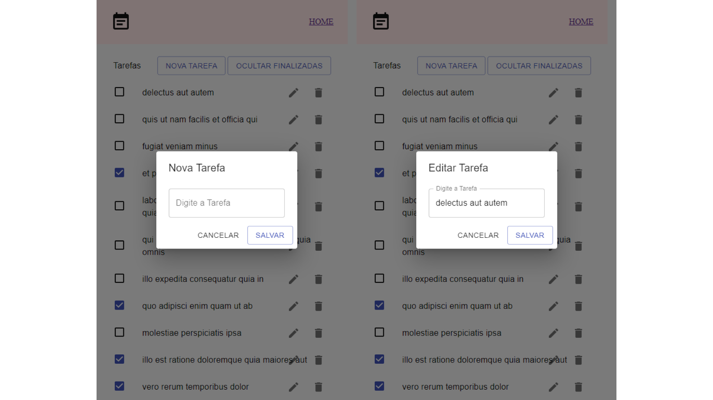
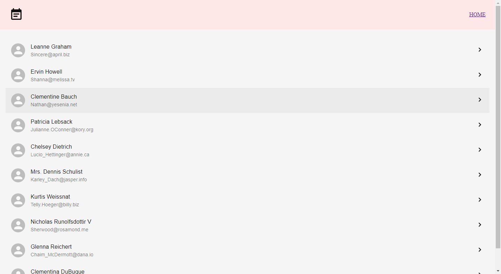

# Prova Técnica Escola Mais

O objetivo desse teste é criar uma TODO List utilizando uma API fornecida por nós.



## Instalação

```sh
$ npm install
$ npm start
```

Você pode conferir o projeto finalizado
[clicando aqui](https://prova-tecnica-escolamais.surge.sh/).



## Implementação

| Legenda                       |
| ----------------------------- |
| ✅ Implementado               |
| 🔳 Implementado com ressalvas |
| ⬜ Não implementado           |

- ✅ Utilizar a API https://jsonplaceholder.typicode.com/ para criar um TODO list;
- ✅ A página inicial do TODO deve mostrar todos os usuários;
- ✅ Ao clicar no usuário o site deve levar para uma página que lista os TODO (tarefas) do usuário em questão;
- ✅ Deve ser possível adicionar um novo item no TODO list de um usuário específico; bem como marcar uma tarefa como concluída ou pendente;



## Versionamento

Usamos [SemVer](http://semver.org/) para versionamento. Para as versões
disponíveis, veja as
[tags neste repositório](https://github.com/inkasadev/prova-tecnica-escolamais/tags).

## Autor

|  |
| :----------------------------------------------------------------------------: |
|               [Phillipe Martins](https://github.com/inkasadev/)                |

## Licença

Este projeto está licenciado sob a Licença MIT - veja o arquivo
[LICENSE.md](LICENSE.md) para detalhes.
